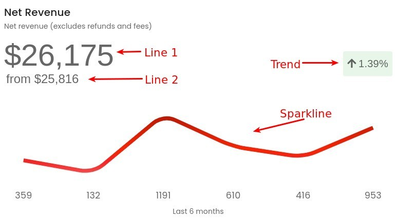

# Big Number Resource



The Big Numbers Resource is for displaying a number, nice and big. It supports the following options

- Line 1
- Line 2
- Trend
- Sparkline

You can pick and choose different sections to create your own custom visualization.

## Defining Resource

All new resource should extend the
[`Laracube\Laracube\Base\ResourceBigNumber`](https://github.com/laracube/laracube/blob/master/src/Base/ResourceBigNumber.php)
abstract class.

Every resource needs to have the `output` method that return an array.

```php
<?php

namespace App\Laracube\Resources;

use App\Models\User;
use Laracube\Laracube\Base\ResourceBigNumber;

class NetRevenue extends ResourceBigNumber
{
    /**
     * Get the output for the resource.
     *
     * @return array
     */
    public function output()
    {
        //
    }
}
```

## Line 1

Line 1 section should return an array with `line1.value` key set.

```php
    return [
        'line1' => [
            'value' => '', // supports HTML
        ],
    ];
```

## Line 2

Line 2 section should return an array with `line2.value` key set.

```php
    return [
        'line2' => [
            'value' => '', // supports HTML
        ],
    ];
```

## Trend

Trend section should return an array with `trend` key set.

```php
    return [
        'trend' => [
            'value' => '', // supports HTML
            'icon' => '',  // supports font-awesome icons
            'class' => '', // apply custom CSS class to the wrapper
        ],
    ];
```

## Sparkline

Trend section should return an array with `sparkline` key set.

```php
    return [
        'sparkline' => [
            'value' => [],
        ],
    ];
```

Sparkline supports the follow `v-sparkline` [API](https://vuetifyjs.com/en/api/v-sparkline/)

| name              | type    | default   | description                                                                                                                                                                                                          |
| ----------------- | ------- | --------- | -------------------------------------------------------------------------------------------------------------------------------------------------------------------------------------------------------------------- | ------------------------------------------------------------------------------------------- | ---------------------------------------------------------------------- |
| autoDraw          | boolean | false     | Trace the length of the line when first rendered                                                                                                                                                                     |
| autoDrawDuration  | number  | 2000      | Amount of time (in ms) to run the trace animation                                                                                                                                                                    |
| autoDrawEasing    | string  | 'ease'    | The easing function to use for the trace animation                                                                                                                                                                   |
| autoLineWidth     | boolean | false     | Automatically expand bars to use space efficiently                                                                                                                                                                   |
| color             | string  | 'primary' | Applies specified color to the control - it can be the name of material color (for example success or purple) or css color (#033 or rgba(255, 0, 0, 0.5)). You can find list of built in classes on the colors page. |
| fill              | boolean | false     | Using the fill property allows you to better customize the look and feel of your sparkline.                                                                                                                          |
| gradient          | array   | []        | An array of colors to use as a linear-gradient                                                                                                                                                                       |
| gradientDirection | string  | 'top'     | The direction the gradient should run                                                                                                                                                                                |
| height            | string  | number    | 75                                                                                                                                                                                                                   | Height of the SVG trendline or bars                                                         |
| labelSize         | number  | string    | 7                                                                                                                                                                                                                    | The label font size                                                                         |
| labels            | array   | []        | An array of string labels that correspond to the same index as its data counterpart                                                                                                                                  |
| lineWidth         | string  | number    | 4                                                                                                                                                                                                                    | The thickness of the line, in px                                                            |
| padding           | string  | number    | 8                                                                                                                                                                                                                    | Low smooth or high line-width values may result in cropping, increase padding to compensate |
| showLabels        | boolean | false     | Show labels below each data point                                                                                                                                                                                    |
| smooth            | boolean | number    | string                                                                                                                                                                                                               | false                                                                                       | Number of px to use as a corner radius. true defaults to 8, false is 0 |
| type              | string  | 'trend'   | Choose between a trendline or bars                                                                                                                                                                                   |
| value             | array   | []        | An array of numbers.                                                                                                                                                                                                 |
| width             | number  | string    | 300                                                                                                                                                                                                                  | Width of the SVG trendline or bars                                                          |
