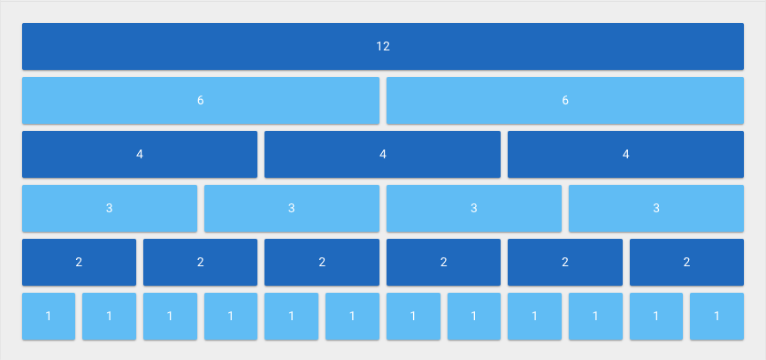

# Resources Configuration

These are the common configuration that is shared across most Resource. 
Individual resource can have additional configuration to enhance their behavior.

## Columns

Laracube uses the 12 grid vuetify system to display resource. 
By default, resources are set to use 3 columns.




To customize the numbers of columns that a resource should you maybe define the `columns` property on the resource class

```php
    /**
     * The columns of the resource.
     *
     * @var int
     */
    public $columns = 3;
```

To customize the number of columns at the time of registering a resource to a report, you can chain the `setColumns` method.

```php
    use App\Laracube\Resources\Revenue\NetRevenue;
   
    /**
     * Get the resources for the report.
     *
     * @return array
     */
     public function resources()
     {
        return [
            (new NetRevenue())->setColumns(6),
        ];
     }
```

## Resource Heading

To customize the "heading" of a resource, you may define a `heading` property on the resource class. 
You can also set the heading to `null` if you don't want to show any heading.

```php
    /**
     * The single value that will be displayed as heading.
     *
     * @var string
     */
    public static $heading = 'heading';
```

## Resource Subheading 

To customize the "sub-heading" of a resource, you may define a `subHeading` property on the resource class. 
You can also set the sub-heading to `null` if you don't want to show any sub-heading.

```php
    /**
     * The single value that will be displayed as sub-heading.
     *
     * @var string
     */
    public static $subHeading = 'sub-heading';
```
